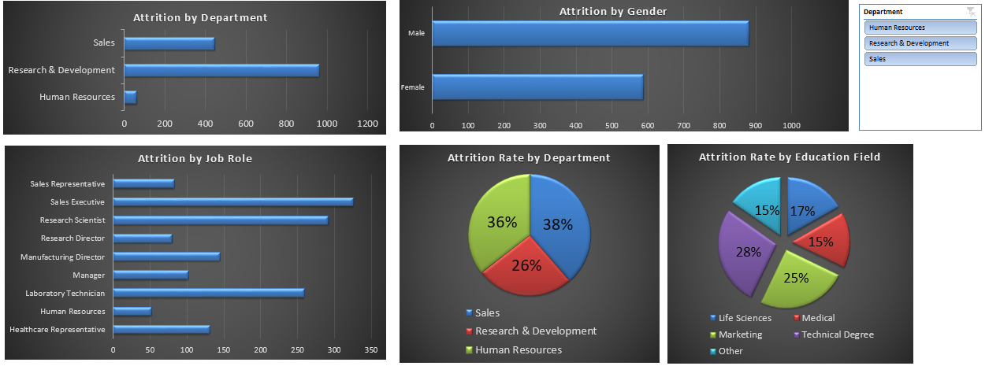

# HR Attrition & Turnover Analytics Dashboard

An interactive and dynamic HR Analytics dashboard designed to analyze employee turnover trends, departmental attrition, and demographic distribution.

## Key Features
- **Dynamic Interactivity:** Integrated with a central Slicer (Filter Panel) connected to multiple Pivot Tables for real-time data exploration.
- **Modern Design:** Utilizes a dark-mode theme designed for corporate presentations and easy data readability.
- **Key Metrics Analyzed:** Attrition by Department, Attrition by Gender, Attrition by Job Role, and Education Field distribution.

## Dashboard Preview

## Tools Used
- Microsoft Excel (Pivot Tables, Pivot Charts, Slicers, Report Connections)
